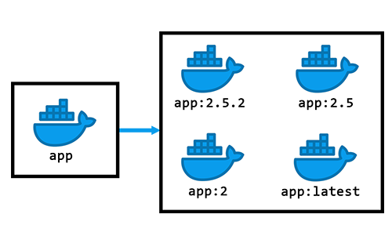

<div align="center">
  
  <h1>CircleCI Container Tagger Orb</h1>
  <i>An orb for automatically tagging container images within CircleCI.</i><br /><br />
</div>

[](https://circleci.com/gh/juburr/container-tagger-orb) [](https://circleci.com/developer/orbs/orb/juburr/container-tagger-orb) [](https://raw.githubusercontent.com/juburr/container-tagger-orb/master/LICENSE) [](https://discuss.circleci.com/c/ecosystem/orbs)

This is an orb for automatically tagging container images within your CircleCI pipeline using semantic versioning, allowing you to release multiple tags simultaneously.

<div align="center">
    
</div>

## Motivation
When releasing new versions of your software, it's often desirable to create multiple tags for a given container image. For example, instead of releasing `:2.5.2` as a single tag, you will often want to release several other tags, to include:
- `:latest` - the latest and greatest version of your software
- `:2.5.2` - the actual version number
- `:2.5` - latest patch in the 2.5 series
- `:2` - latest release in the 2 series

While this may seem straightforward, it’s not appropriate to do this for every release. For instance, if you later release an emergency security patch for the older 2.4 series of your software, you wouldn’t want to tag that image with the `:latest` tag -- or even the `:2` tag, for that matter. The new image should only receive two tags:
- `:2.4.8` - the actual version number
- `:2.4` - latest patch in the 2.4 series

Some projects may also choose to maintain an `:edge` tag that contains the latest successful merges into the trunk, which have not yet received an official tag. This allows you to easily pull down pre-release images before the next official release. This is useful for deploying images to internal staging environments.

This orb will handle these edge cases and more.

## Assumptions and Strategy

This orb requires that your git tags follow semantic versioning. Examples of valid tags include:
- `v2.5.2`
- `v2.5.3-rc1`
- `v2.5.3-alpha1`
- `v2.5.3-beta4`

This orb functions by pulling down your project's `git tag` list to determine which versions already exist.

Any merge into `master`, `main`, or `develop` will result in an `:edge` tag being created, provided your container build job is within a workflow that builds on non-tagged commits.

Running a Golang monorepo where you're creating tags such as `microservices/authservice/v1.0.5`? No problem. This is supported as well. Currently, you need to supply a `package: microservices/authservice` argument, but this could potentially be determined automatically in a future release.

## Example Usage

The following example shows how to build a container image and then push it to a registry using this orb's automatic tag generation feature.

```yaml
usage:
  version: 2.1

  orbs:
    tagger: juburr/container-tagger-orb@0.7.2

  parameters:
    docker_version:
      type: string
      default: "default"

  jobs:
    container_build:
      docker:
        - image: cimg/base:current-22.04
      steps:
        - checkout
        - setup_remote_docker:
            version: << pipeline.parameters.docker_version >>
            docker_layer_caching: true
        - run:
            name: Build Docker Container
            command: |
              # Customize based on the needs of your project
              # In practice you will likely have many more build arguments, OCI labels, etc.
              docker build \
                --build-arg CREATED_ON=$(date -u +'%Y-%m-%dT%H:%M:%SZ') \
                --build-arg GITHUB_TOKEN=$GITHUB_TOKEN \
                --label org.opencontainers.image.source="https://github.com/org/repo" \
                -t localimage \
                -f containers/prod/localimage/Dockerfile \
                .
        - tagger/generate_tags:
            outfile: tags.txt
        - tagger/tag:
            source_image: localimage
            target_image: ghcr.io/org/repo/image
            tags_file: tags.txt
        - run:
            name: Authenticate with GHCR
            command: echo $GITHUB_TOKEN | docker login ghcr.io -u $GITHUB_USER --password-stdin
        - tagger/push:
            target_image: ghcr.io/org/repo/image
            tags_file: tags.txt
        - run:
            name: Logout from GHCR
            command: docker logout ghcr.io

  workflows:
    on-tag:
      jobs:
        - container_build:
            context:
              - yourproject-github-pkg-rw
            filters:
              branches:
                ignore: /.*/
              tags:
                only: /^v(?!0\d)[0-9]+(\.(?!0\d)[0-9]+){2}(\-(rc|alpha|beta)?(?!0\d)[0-9]+)?$/
```
