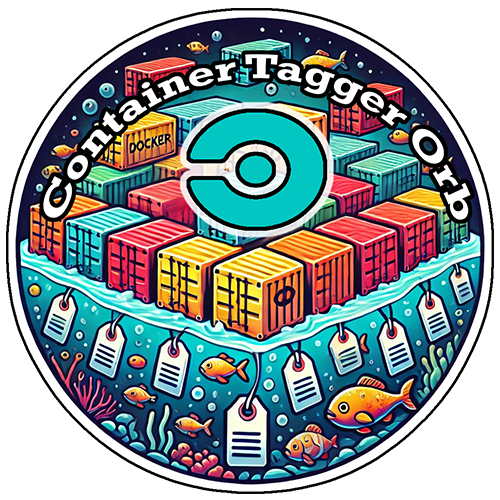
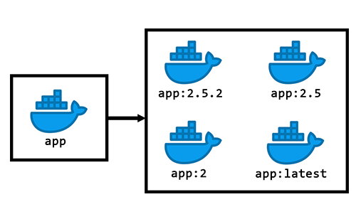

  
  <h1>CircleCI Container Tagger Orb</h1>
  <i>An orb for automatically tagging container images within CircleCI.</i>  

   

This is an orb for automatically tagging container images within your CircleCI pipeline using semantic versioning, allowing you to release multiple tags simultaneously.

    

### Motivation
Why is something like this helpful or even necessary?

For new versions of your software, it's often desirable to release multiple tags for a given image. For example, instead of just releasing `:2.5.2` as a single tag for your new image, you may also want to tag it as `:latest`, `:2.5`, and `:2`, signifying that it's the latest version of your software, as well as the latest in both the 2- and 2.5-series of your software.

Now suppose that next week you want to release an emergency security patch to the 2.1 series of your software.. In that scenario, you don't necessarily want to tag that image as `:latest`.. or even as the latest image in the `:2` series for that matter. In that case, the new image should only receive two tags: `:2.1.8`, and `:2.1`.

Some projects may also want to maintain an `:edge` tag containing the very latest succesful merges into trunk, allowing you to easily pull down images prior to the next release going out.

This orb will take care of these edge cases and more.

### Assumptions and Strategy

This orb requires that your git tags are semantically versioned. Examples of valid tags include `v2.5.2`, `v2.5.3-rc1`, `v2.5.3-alpha1`, or `v2.5.3-beta4`.

This orb traverses through your project's `git tag` list to automatically determine if the newest version of your software is worthy of receiving tags such as `:latest`, or `:2`.

Any merge into `master`, `main`, or `develop` will result in an `:edge` tag being created, assuming your container build job is within a workflow that builds on non-tags.
